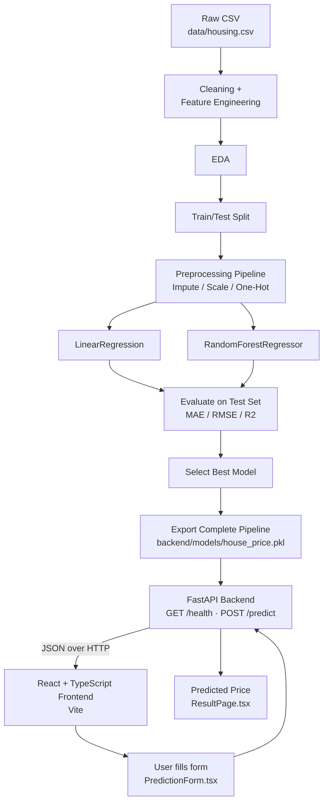

# House Price Prediction — California Housing

An end-to-end machine learning web application that predicts the median
house value for a California census block group: raw data → cleaning →
feature engineering → EDA → model training/evaluation → exported
scikit-learn pipeline → FastAPI backend → React + TypeScript frontend.

## Table of Contents

1. [Project Overview](#project-overview)
2. [Problem Statement](#problem-statement)
3. [Solution](#solution)
4. [Architecture Diagram](#architecture-diagram)
5. [ML Workflow](#ml-workflow)
6. [Tech Stack](#tech-stack)
7. [Dataset](#dataset)
8. [Project Structure](#project-structure)
9. [Notebook Instructions](#notebook-instructions)
10. [Backend: Installation & Execution](#backend-installation--execution)
11. [Frontend: Installation & Execution](#frontend-installation--execution)
12. [Environment Variables](#environment-variables)
13. [API Reference](#api-reference)
14. [Model Comparison & Final Metrics](#model-comparison--final-metrics)
15. [Screenshots](#screenshots)
16. [Testing](#testing)
17. [GitHub Usage](#github-usage)
18. [Limitations](#limitations)
19. [Future Improvements](#future-improvements)

---

## Project Overview

> **Note on dataset scope.** This project was originally scoped around an
> Indian real-estate listings dataset (carpet area, floor, furnishing,
> location name, etc.). The dataset actually supplied is the classic
> **California Housing** dataset (1990 U.S. Census, block-group level).
> Every stage of this project — cleaning, feature engineering, the model's
> input schema, the backend, and the frontend form — was built around the
> **real** columns present in `data/housing.csv`, not the originally
> assumed schema. See `notebooks/house_price_model.ipynb`, Section 1, for
> details.

## Problem Statement

Given aggregated 1990 census statistics for a California block group
(location, housing age, room/bedroom counts, population, households,
median income, and proximity to the ocean), predict the block group's
median house value in USD.

## Solution

A complete `scikit-learn` `Pipeline` — feature engineering, imputation,
scaling, one-hot encoding, and the regressor itself — is trained once in a
Jupyter notebook and exported as a single artifact (`house_price.pkl`). A
FastAPI backend loads that one artifact at startup and exposes it over a
validated REST API. A React + TypeScript frontend collects user input,
validates it client-side, calls the API, and displays the prediction.

Because the entire preprocessing chain lives inside the exported pipeline,
**the backend never reimplements encoding/scaling logic** — it hands a raw
DataFrame to `pipeline.predict()` and returns the result.

## Architecture Diagram



## ML Workflow

| Stage | What happens | Where |
|---|---|---|
| Load & inspect | Shape, dtypes, missing values, target distribution | Notebook §2–6 |
| EDA | 4+ labeled plots with written interpretation | Notebook §7 |
| Cleaning | Drop censored target rows, dedupe, validate ranges | Notebook §8 |
| Feature engineering | 3 ratio features via a shared, importable function | Notebook §9 |
| Outlier handling | Documented, deliberately non-aggressive | Notebook §10 |
| Feature selection | Final numeric + categorical feature list | Notebook §11 |
| Split | `train_test_split(test_size=0.2, random_state=42)` | Notebook §12 |
| Preprocessing | `ColumnTransformer` (impute/scale/one-hot) | Notebook §13 |
| Modeling | `LinearRegression`, `RandomForestRegressor` | Notebook §14 |
| Evaluation | MAE, RMSE, R² on the **test set only** | Notebook §15–16 |
| Selection | Highest R² / lowest error wins, reasoning documented | Notebook §17 |
| Export | Full pipeline → `.pkl`, categories → `locations.json` | Notebook §20–21 |
| Sanity check | Reload `.pkl` from disk, re-predict, assert match | Notebook §22 |

## Tech Stack

**ML / Notebook:** Python, pandas, scikit-learn, matplotlib, seaborn, joblib, Jupyter
**Backend:** FastAPI, Pydantic v2, pydantic-settings, uvicorn, pytest, httpx
**Frontend:** React 19, TypeScript, Vite, react-router-dom

## Dataset

**Source:** [California Housing — Kaggle](https://www.kaggle.com/datasets/juhibhojani/house-price)
20,640 rows × 10 columns, 1990 U.S. Census block-group data.

### Dataset Download Instructions

The raw CSV is **not committed** to this repository (see `.gitignore`).
To reproduce the notebook:

1. Download the dataset from the Kaggle link above (requires a free Kaggle account).
2. Place the file at `data/housing.csv` in the project root.
3. Run the notebook (see [Notebook Instructions](#notebook-instructions)).

## Project Structure

```
house-price-prediction/
├── data/                        # raw CSV goes here (gitignored)
├── docs/                        # EDA / evaluation plots exported by the notebook
├── notebooks/
│   └── house_price_model.ipynb  # full 23-section training notebook
├── backend/
│   ├── app/
│   │   ├── main.py              # FastAPI app, lifespan model loading, CORS
│   │   ├── api/routes/prediction.py   # GET /health, POST /predict
│   │   ├── core/config.py       # pydantic-settings configuration
│   │   ├── schemas/prediction.py      # request/response validation
│   │   ├── services/
│   │   │   ├── preprocessing.py # SHARED feature-engineering (notebook + backend)
│   │   │   └── inference.py     # loads house_price.pkl once, predicts
│   │   └── utils/logging_config.py
│   ├── models/
│   │   ├── house_price.pkl      # exported trained pipeline
│   │   └── locations.json       # allowed ocean_proximity categories
│   ├── tests/test_prediction.py
│   ├── requirements.txt
│   ├── .env.example
│   └── Dockerfile
├── frontend/
│   ├── src/
│   │   ├── api/predictionClient.ts
│   │   ├── components/PredictionForm.tsx
│   │   ├── pages/{HomePage,ResultPage,NotFoundPage}.tsx
│   │   ├── types/prediction.ts
│   │   ├── utils/validation.ts
│   │   └── App.tsx
│   ├── public/locations.json    # served statically, populates the dropdown
│   └── .env.example
└── .gitignore
```

## Notebook Instructions

```bash
# from the project root
pip install -r backend/requirements.txt jupyter matplotlib seaborn nbconvert --break-system-packages
# place the dataset at data/housing.csv first (see Dataset section above)

cd notebooks
jupyter nbconvert --to notebook --execute --inplace house_price_model.ipynb
# or open house_price_model.ipynb in Jupyter and Kernel -> Restart & Run All
```

Running the notebook regenerates `backend/models/house_price.pkl`,
`backend/models/locations.json`, `frontend/public/locations.json`, and the
plots in `docs/`.

## Backend: Installation & Execution

```bash
cd backend
python3 -m venv .venv && source .venv/bin/activate   # optional but recommended
pip install -r requirements.txt

cp .env.example .env   # adjust CORS_ORIGINS etc. if needed

uvicorn app.main:app --host 0.0.0.0 --port 8000 --reload
```

The API will be live at `http://localhost:8000`, with interactive docs at
`http://localhost:8000/docs`.

## Frontend: Installation & Execution

```bash
cd frontend
npm install

cp .env.example .env   # set VITE_API_BASE_URL to your backend URL

npm run dev
```

The app will be live at `http://localhost:5173` (default Vite port).

## Environment Variables

**`backend/.env`** (see `backend/.env.example`):

| Variable | Default | Description |
|---|---|---|
| `APP_NAME` | `House Price Prediction API` | Display name |
| `ENVIRONMENT` | `development` | Environment label |
| `MODEL_PATH` | `models/house_price.pkl` | Path to the exported pipeline |
| `LOCATIONS_PATH` | `models/locations.json` | Path to allowed categories |
| `CORS_ORIGINS` | `http://localhost:5173,http://127.0.0.1:5173` | Comma-separated allowed origins |

**`frontend/.env`** (see `frontend/.env.example`):

| Variable | Default | Description |
|---|---|---|
| `VITE_API_BASE_URL` | `http://localhost:8000` | Backend base URL, no trailing slash |

## API Reference

### `GET /health`

```json
{ "status": "ok" }
```

### `POST /predict`

Request body — every field required, validated by Pydantic (see
`backend/app/schemas/prediction.py` for exact ranges):

```json
{
  "longitude": -122.23,
  "latitude": 37.88,
  "housing_median_age": 41,
  "total_rooms": 880,
  "total_bedrooms": 129,
  "population": 322,
  "households": 126,
  "median_income": 8.3252,
  "ocean_proximity": "NEAR BAY"
}
```

Example response (from a real run of this exact backend):

```json
{ "predicted_price": 407785.32 }
```

An invalid payload (missing field, out-of-range value, or an
`ocean_proximity` outside `["<1H OCEAN", "INLAND", "ISLAND", "NEAR BAY", "NEAR OCEAN"]`)
returns **HTTP 422** with a Pydantic validation error body.

Interactive Swagger docs are auto-generated at `/docs` when the backend is running.

## Model Comparison & Final Metrics

*(Real numbers from the executed notebook — see `notebooks/house_price_model.ipynb`, §16–17.)*

Rows before cleaning: **20,640** → rows after cleaning: **19,675**
(965 top-coded/censored target rows dropped, 4.68%).
12 total input features (8 raw numeric + 3 engineered + 1 categorical).

| Model | MAE (USD) | RMSE (USD) | R² |
|---|---:|---:|---:|
| **RandomForestRegressor (winner)** | **$31,460** | **$46,842** | **0.7799** |
| LinearRegression | $45,199 | $61,864 | 0.6162 |

**Why RandomForestRegressor was selected:** it beats the linear baseline on
every metric — about 30% lower MAE, ~24% lower RMSE, and explains ~78% of
test-set variance vs. ~62% for the linear model. This matches expectations:
the relationship between location/income and price involves non-linear
interactions (e.g. income matters differently depending on ocean proximity)
that a plain linear model cannot represent.

`RandomForestRegressor` hyperparameters (`n_estimators=120, max_depth=14,
min_samples_leaf=5`) were deliberately constrained versus an unconstrained
forest, trading a small, disclosed amount of accuracy (R² ~0.787 → ~0.780)
for a ~9x smaller artifact (187MB → 20.8MB) that's practical to commit and
load quickly — see the notebook's Section 14 hyperparameter note.

## Screenshots

EDA and evaluation plots generated by the notebook are saved in [`docs/`](docs/):

- `docs/eda_target_distribution.png` — target distribution + censoring spike
- `docs/eda_price_vs_rooms.png` — price vs. total rooms
- `docs/eda_price_by_location.png` — average price by ocean proximity
- `docs/eda_price_by_age.png` — price by housing-age bucket
- `docs/eda_correlation_heatmap.png` — numeric feature correlations
- `docs/eda_engineered_outliers.png` — engineered feature boxplots
- `docs/model_comparison_r2.png` — R² bar chart, both models
- `docs/predicted_vs_actual.png` — predicted vs. actual scatter (winning model)

For running-application screenshots (backend `/docs` page, frontend form
and result page), capture them from your own run of the app per the setup
instructions above and add them to this section.

## Testing

```bash
cd backend
pytest -v
```

Four tests in `backend/tests/test_prediction.py`:
1. `test_health_check` — `/health` returns `{"status": "ok"}`
2. `test_predict_valid_request_returns_price` — valid payload → 200 + a positive predicted price
3. `test_predict_invalid_request_returns_422` — missing field + invalid category → 422
4. `test_predict_negative_area_returns_422` — out-of-range numeric value → 422

All four pass against the real trained model (the test client's lifespan
loads `backend/models/house_price.pkl`).

## GitHub Usage

```bash
cd house-price-prediction
git init
git add .
git commit -m "Initial commit: House Price Prediction end-to-end ML app"
git branch -M main
git remote add origin <your-repo-url>
git push -u origin main
```

The `.gitignore` at the project root already excludes the raw dataset,
`.env` files, `node_modules/`, `dist/`, Python caches, and Jupyter
checkpoints. `backend/models/house_price.pkl` (20.8 MB) **is** committed, as
its size is small enough to be practical in a Git repo.

## Limitations

- Trained on 1990 U.S. Census data — dollar predictions are not
  representative of the current California housing market; this is a
  demonstration of the ML/engineering pipeline, not a live valuation tool.
- `ocean_proximity == "ISLAND"` has only 5 rows in the entire dataset; the
  model has essentially no real signal for that category.
- Block-group-level data cannot capture individual-house attributes
  (exact condition, lot size, exact bedroom count of one specific house)
  — predictions are neighborhood-level estimates.
- Test-set R² of ~0.78 means roughly 22% of price variance is unexplained
  by the available features; predictions should be read as estimates with
  meaningful uncertainty, not exact valuations.

## Future Improvements

- Engineer geospatial features (distance to nearest major city / coastline)
  instead of relying on raw latitude/longitude.
- Try gradient-boosted models (XGBoost/LightGBM) with hyperparameter search.
- Add prediction confidence intervals (e.g. via quantile regression forests).
- Recalibrate against a modern dataset for real-world usability.
- Add Dockerized `docker-compose` wiring the backend and frontend together.
